// -*- mode: adoc ; fill-column: 120 -*-
// ---- Beginn Standardheader
= Elektronischer Hauptschalter
Wilhelm Meier <wilhelm.wm.meier@googlemail.com>
:revnumber: 0.01
:revdate: 01.01.1970
:revremark: undefined
:lang: de
:toc:
:toc-title: Inhalt
:toclevels: 4
:numbered:
:src_numbered: 
:icons: font
:icontype: svg
:figure-caption: Abbildung
:description: Elektronischer Hauptschalter
:title: Elektronischer Hauptschalter
:sectanchors:
:sectlinks:
:experimental:
:copyright: Wilhelm Meier
:duration: 90
:source-highlighter: coderay
:coderay-css: style
:source-highlighter: pygments
:pygments-css: class
:status:
:menu:
:navigation:
:split:
:goto:
:blank:
:deckjs_theme: swiss
:showtitle:
:deckjs_transition: horizontal-slide
//:stylesdir: ./css
//:stylesheet: deckjs.css
:docinfo1:
:stem:
:customcss: css/deckjs.css
// not working
:revealjs_theme: black
:revealjs_slidenumber: true
// for attributes in link:[] macro like link:xxx[window="_blank"]
:linkattrs:
:nofooter:

:imgdir: images

//:short: // without images 

//include::license.adoc[]

== Symbolerklärung

[TIP]
Ein wichtiger allgemeiner Hinweis für den sicheren Aufbau und die sichere Bedienung. Dieser sollte durch den Anwender bachtet werden,
um einen sicheren Betrieb zu gewährleisten.

[NOTE]
Ein genereller Hinweis, der durch den Anwender beachtet werden sollte.

[IMPORTANT]
Ein technischer oder sicherheitstechnischer Hinweis, der unbedingt durch den Anwender beachtet werden muss.

[CAUTION]
Ein technischer oder sicherheitstechnischer Gefahrenhinweis, der unbedingt durch den Anwender beachtet werden muss. Zur 
Gefahrenabwendung muss der Anwender unbedingt die gegebenen Anweisungen befolgen und die beschriebenen Maßnahmen ergreifen.

== Rechtliches

Der vorliegende Bausatz wird dem Anwender für eigene Experimente überlassen. Er stellt kein Produkt im Sinne des ProdHaftG 
oder elektronisches Gerät im Sinne des ElektroG dar und wird als Gerät nicht kommerziell vertrieben. 

[IMPORTANT]
--
Die Überlassung gegen Unkostenerstattung erfolgt unter Ausschluss jeglicher Sach­mangelhaftung.

// Die Haftung wegen Arglist und Vorsatz sowie auf Schaden­ersatz wegen Körperverletzungen 
// sowie bei grober Fahr­lässig­keit oder Vorsatz bleibt unbe­rührt.

Für den vorliegenden Bausatz werden keine Funktionsgarantien gegeben. Für Schäden am Bausatz oder an damit verbundenen Geräten oder Modulen
wird keine Haftung übernommen. Gewährleistungen, Garantien und Widerrufsrechte gibt es nicht.
--

== Sicherheitshinweise

Beim Umgang mit Produkten, die mit elektrischer Spannung in Berührung kommen, müssen die gültigen VDE-Vorschriften beachtet werden, insbesondere 
VDE 0100, VDE 0550/0551, VDE 0700, VDE 0711 und VDE 0860.

Werkzeuge dürfen an Geräten, Bauteilen oder Baugruppen nur benutzt werden, wenn sichergestellt ist, dass die Geräte von der Versorgungsspannung 
getrennt sind und elektrische Ladungen, die in den im Gerät befindlichen Bauteilen gespeichert sind, vorher entladen wurden.

Spannungsführende Kabel oder Leitungen, mit denen das Gerät, das Bauteil oder die Baugruppe verbunden ist, müssen stets auf Isolationsfehler 
oder Bruchstellen untersucht werden. Bei Feststellen eines Fehlers in der Zuleitung muss das Gerät unverzüglich aus dem Betrieb genommen werden, 
bis die defekte Leitung ausgewechselt worden ist. Bei Einsatz von Bauelementen oder Baugruppen muss stets auf die strikte Einhaltung der in der 
zugehörigen Beschreibung genannten Kenndaten für elektrische Größen hingewiesen werden. Wenn aus einer vorliegenden Beschreibung für den nicht 
gewerblichen Endverbraucher nicht eindeutig hervorgeht, welche elektrischen Kennwerte für ein Bauteil oder eine Baugruppe gelten, wie eine 
externe Beschaltung durchzuführen ist oder welche externen Bauteile oder Zusatzgeräte angeschlossen werden dürfen und welche Anschlusswerte 
diese externen Komponenten haben dürfen, so muss stets ein Fachmann um Auskunft ersucht werden. Es ist vor der Inbetriebnahme eines Gerätes 
generell zu prüfen, ob dieses Gerät oder Baugruppe grundsätzlich für den Anwendungsfall, für den es verwendet werden soll, geeignet ist!

Im Zweifelsfalle sind unbedingt Rückfragen bei Fachleuten, Sachverständigen oder den Herstellern der verwendeten Baugruppen notwendig!

Bitte beachten Sie, dass Bedien- und Anschlussfehler außerhalb unseres Einflussbereiches liegen. Verständlicherweise können wir für Schäden, die 
daraus entstehen, keinerlei Haftung übernehmen. Bei Installationen und beim Umgang mit Netzspannung sind unbedingt die VDE-Vorschriften zu 
beachten. Geräte, die an einer Spannung über 35 V betrieben werden, dürfen nur vom Fachmann angeschlossen werden. In jedem Fall ist zu prüfen, 
ob der Bausatz oder die Platine für den jeweiligen Anwendungsfall und Einsatzort geeignet ist bzw. eingesetzt werden kann.

Derjenige, der eine Schaltung oder einen Bausatz aufbaut und fertigstellt oder eine Baugruppe durch Erweiterung bzw. Gehäuseeinbau 
betriebsbereit macht, gilt nach DIN VDE 0869 als Hersteller und ist verpflichtet, bei der Weitergabe des Gerätes alle Begleitpapiere 
mitzuliefern und auch seinen Namen und Anschrift anzugeben. Geräte, die aus Bausätzen selbst zusammengestellt werden, sind sicherheitstechnisch 
wie ein industrielles Produkt zu betrachten.

Für alle Personen- und Sachschäden, die aus nicht bestimmungsgemäßer Verwendung entstehen, ist nicht der Hersteller sondern der Betreiber 
verantwortlich. Bitte beachten Sie, das Bedien- und/und Anschlussfehler außerhalb unseres Einfußbereiches liegen. Verständlicherweise können wir 
für Schäden, die daraus entstehen, keinerlei Haftung übernehmen.

Jegliche Vorschriften und Vorsichtsmaßnahmen im Umgang mit elektrischen Komponenten sind vom Anwender einzuhalten.

Beachten Sie ebenfalls die Richtlinien unter <<Betrieb>>.

== Spezieller Sicherheitshinweis: Kleinteile

[CAUTION]
--
ACHTUNG: Der Bausatz enthält verschluckbare Kleinteile. Von Kindern fernhalten.
--

== Einbau 

[NOTE]
Das Modul wie auch diese Doku ist noch unvollständig und _work-in-progess_. 
Bei jeglichen Unklarheiten in dieser Funktionsbeschreibung und generellem Aufbau und Anschluß, 
unterlassen Sie den Betrieb und kontaktieren Sie den Bausatzersteller.

.Varianten
****
Vergewissern Sie sich vor dem Einbau, dass Sie die passenden Varianten (s.a. <<Variants>>) des Moduls 
zu Ihrem Anwendungsfall (max. Spannung, max. Stromstärke) vorliegen haben (s.a. <<Var1>> und <<Var2>>).
****

Das Modul dient zum zentralen Einschalten der zentralen Stromversorgung von Schiffsmodellen. Das Einschalten und das Ausschalten 
erfolgen über einen Tastkontakt. Das Modul gibt akustische Rückmeldung über seinen Zustand.

Das folgende Bild zeigt den Einbau schematisch:

[[schema1]]
.Schematischer Anschluß des Moduls an Akku, Verbraucher und Kontakt
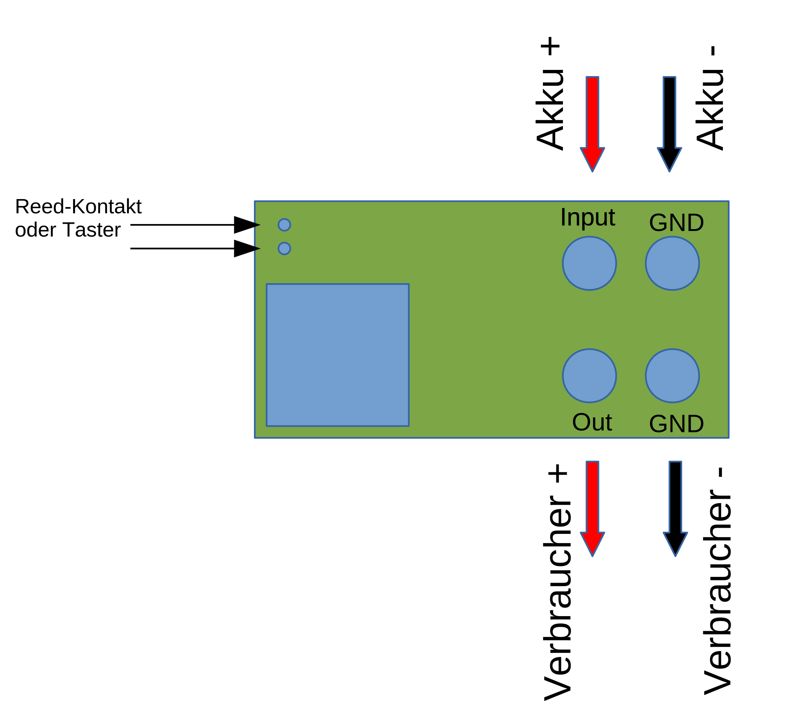

=== Anschluß an den Akku

Für einen ordnungsgemäßen Betrieb ist das Modul mit entsprechenden Kabeln zu versehen, die einen ausreichenden Querschnitt aufweisen (s.u.).

Die Anschlüsse `In(+)` / `Gnd` sind mit dem Akku zu verbinden.

Die Anschlüsse `Out` / `Gnd` sind mit den zu versorgenden Geräten zu verbinden.

Ein Verpolen der Anschlüsse kann zu einem Defekt führen.

[TIP]
Beim ersten Anschluß an den Akku ertönt eine aufsteigende Tonfolge. Danach ein tiefer Ton, um anzuzeigen, dass das Modul 
in den Zustand `AUS` wechselt.

=== Anschluß des Tastkontaktes

An den mit `Taster` gekennzeichneten Pfostenverbinder ist ein Taster (kein Schalter) oder Reed-Kontakt anzuschließen. 

[CAUTION]
--
Der Anschluß des Tasters sollte über ein verdrilltes Leitungspaar erfolgen. Es reicht ein sehr dünner Querschnitt aus, da hier keine 
hohen Ströme fließen. Das Leitungspaar sollte nicht parallel zu Leitungen mit hohen Strömen und Impulsen (etwa Motorzuleitungen) 
im Modell verlegt werden. Die Leitungslänge sollte 75cm nicht überschreiten.
--

Vor der Montage eines Reed-Kontaktes die _Vorzugsrichtung_ des Reed-Kontaktes ermitteln, damit ein sicheres Ansprechen 
gewährleistet ist. Vorsicht beim Biegen der Anschlußdrähte eines 
Reed-Kontaktes, denn diese brechen leicht.

Beachten Sie den maximalen Abstand des Magneten zum Reed-Kontakt bei der Montage. Mehr als 1,5mm kann zu Problemen beim 
Ein- oder Ausschalten führen. Dies hängt wesentlich von der Stärke des Magneten ab.

=== Position

Bauen Sie das Modul so ein, das ein gute Schallübertragung möglich ist. Die seitliche Öffnung des Piezo-Summers darf nicht verdeckt werden.

=== Schutz 

Um das Modul gegen Feuchtigkeit zu schützen und glichzeitig die Schallausbreitung nicht zu beeinträchtigen, empfielt es sich, das Modul 
mit Polyurethan-Lack-Schutzlack (z.B. Kontakt 70) zu überziehen. Bitte kleben Sie jedoch voher den Pfostenverbinder für den Kontackt, den 
Piezosummer und (falls noch nicht angelötet) die Lötringe für die Anschlußkabel ab.

Ein Einschrumpfen mit Schrumpfschlauch ist möglich, aber auch hier muss streng darauf geachtet werden, dass eine gute Schallausbreitung
ermöglicht bleibt.

=== Master / Slave

Es ist auch möglich, mehrere Schaltmodule mit _einem_ einzigen Kontakt zu schalten. Dazu wird ein Modul ganz normal wie 
in <<schema1>> gezeigt mit dem zugehörigen Akku, Verbraucher und Kontakt verbunden. Zu jedem weiteren Modul werden nun folgende
Verbindungen hergestellt:

. Die Tasterkontakte, die zum Piezosummer direkt benachbart sind, werden miteinander verbunden (dünnes Kabel).
. Die Massen (GND, Akku -) _müssen_ auch miteinander verbunden werden. Üblicherweise ist dies bei mehreren Versorgungskreisen 
schon gegeben. Sollte dies nicht der Fall sein, so _muss_ eine Verbindung hergestellt werden.

.Schematischer Anschluß eines Master-Moduls mit einem Slave-Modul
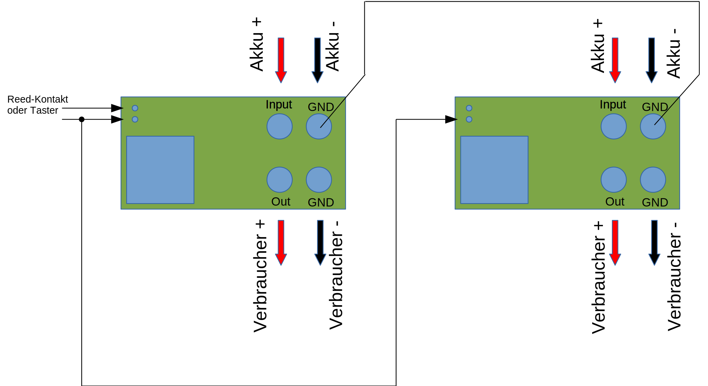

[CAUTION]
Ein galvanische Trennung der Versorgungskreise ist nur mit einem zusätzlichen Optokoppler möglich.

[TIP]
Bei einer Aufteilung der Versorgungskreise in einen Master und (mehrere) Slaves ist es von Vorteil, die Slaves mit einer 
größeren Einschaltverzögerung zu versehen, als den Master (s.a. <<Prog>>).

== Funktion

[IMPORTANT]
--
Die Funktion dieses Bausatzes wird wesentlich durch Software des Bausatzes bereit gestellt. Eine Veränderung der Software ist durch den 
Anwender möglich. Der Anwender hat sich vor dem Einsatz der bereitgestellten Software des Moduls anhand des mitgelieferten 
Source-Codes davon zu überzeugen, dass die im folgenden beschriebene Funktion auch tatsächlich eingehalten wird und sich 
keine Fehlfunktionen ergeben. Der Bausatzersteller gibt keine irgendwie geartete Funktionsgarantie für die Software des Moduls.

Durch den Anwender aufgebrachte, veränderte Software kann einen anderen Betrieb ermöglichen und gleichzeitig erhöhte bzw. veränderte 
Gefahren mit sich bringen.
--

[[funcon]]
=== Einschalten

.Vorsichtsmaßnahmen
[CAUTION]
--
Treffen Sie die üblichen Sicherheitsvorkehrungen beim Einschalten von Stromversorgungen in Modellen.

Schalten Sie den Sender _vorher_ ein. Kontrollieren Sie die _Gasstellung_.
--

Betätigen Sie den Kontakt dauerhaft. Es ertönt _dreimal_ ein Ton mittlerer Höhe im Sekundentakt. Anschließend ertönt ein 
hoher Ton. Dies zeigt die nun folgende Betriebsbereitschaft an. Beim _nächsten hohen_ Ton wird eingeschaltet (s.a. <<Prog>>). 
Der Kontakt kann nun 
losgelassen werden. Nun ist das Modul im Zustand `EIN`.

Wird der Kontakt vorzeitig losgelassen, bleibt das Modul im Zustand `AUS`. Zur Kontrolle ertönt ein tiefer Ton.

Um das Modul wieder auszuchalten, muss der Kontakt kurz getrennt werden.

[[funcoff]]
=== Ausschalten

.Ausschalten von induktiven Lasten
[CAUTION]
--
Schalten Sie keine direkt angeschlossenen, induktiven Lasten (große Motoren, Transformatoren) im laufenden Betrieb aus. 
Dadurch kann das Modul zerstört werden, wenn der maximale Schaltstrom überschritten wird (s.a. <<Variants>>). 
--

Betätigen Sie den Kontakt dauerhaft. Es ertönt _dreimal_ ein Ton mittlerer Höhe im Sekundentakt. Anschließend ertönt ein 
tiefer Ton. Dies zeigt die nun folgende Ausschaltbereitschaft an. Beim _nächsten tiefen_ Ton wird ausgeschaltet. Der Kontakt kann nun 
losgelassen werden. Nun ist das Modul im Zustand `AUS`.

Wird der Kontakt vorzeitig losgelassen, bleibt das Modul im Zustand `EIN`. Zur Kontrolle ertönt ein hoher Ton.

Um das Modul wieder einzuchalten, muss der Kontakt kurz getrennt werden.

=== Ruhe

Ist das Modul im Zustand `AUS`, geht es nach ca. 3 Sekunden in den Schlafzustand. Es verbraucht nun sehr wenig Strom (<= 2 µA) 
(Achtung: s.a. <<Betrieb>>) 

[[Prog]]
=== Programmierung

=== Einschaltverzögerung

Die Verzögerung vom Zeitpunkt der Betriebsbereitschaft bis zum Einschalten kann programmiert werden. Im Normalfall ist diese 
Verzögerung 1s. 

Wenden Sie folgendes Vorgehen an:

. Trennen Sie das Modul vom Akku.
. Trennen Sie alle Verbraucher.
. Verbinden Sie den Akku bei betätigtem (Reed-) Kontakt und halten Sie den Kontakt.
. Das Modul lässt einen, zwei oder drei normale oder ein oder zwei hohe Töne in schneller Folge mit einer langen Pause ertönen.
. Halten Sie den Kontakt weiter, um die Einschaltverzögerung zu verändern. Damit wird von _ein -> zwei_, oder von 
_zwei -> drei_ oder von _drei -> ein_ Sekunden Verzögerungszeit sowie Softstart aus/ein zyklisch umgeschaltet. 
Entscheidend ist die Rückmeldung mit der normalen Tonhöhe. Die Anzahl der Töne entspricht der Verzögerung in Sekunden.
. Bei der gewünschten Konfiguration lassen Sie den Kontakt los. Nach 5 Sekunken ertönt eine absteigende Tonfolge, um zu signalisieren, dass die 
Programmierung erfolgreich war. 
. Ist die Tonefolge beendet, trennen Sie anschließend das Modul wieder vom Akku.
. Nach mindestens 3 Sekunden Wartezeit können Sie es wieder verbinden. Es zeigt wie gewohnt seine Betriebsbereitschaft mit einer _aufsteigenden_ 
Tonfolge an. Für die folgende Einschaltsequenz ist die Verzögerungszeit nun entsprechend gesetzt.

Anmerkung: Solange die absteigende Tonfolge noch nicht ertönt, können Sie den Kontakt wieder schließen und halten, um die Programmierung 
wieder zu ändern.

=== Softstart

Vor dem Einsatz des _Softstart_ muss der Anwender des Moduls sicherstellen, dass diese Betriebsart von allen angeschlossenen 
Verbrauchern ermöglicht wird, und diese Verbraucher dadurch keine Fehlfunktion zeigen.

Wenden Sie folgendes Vorgehen an:

. Trennen Sie das Modul vom Akku.
. Trennen Sie alle Verbraucher.
. Verbinden Sie den Akku bei betätigtem (Reed-) Kontakt und halten Sie den Kontakt.
. Das Modul lässt einen, zwei oder drei normale oder ein oder zwei hohe Töne in schneller Folge mit einer langen Pause ertönen.
. Halten Sie den Kontakt weiter, um die Einschaltverzögerung zu verändern. Damit wird von _ein -> zwei_, oder von 
_zwei -> drei_ oder von _drei -> ein_ Sekunden Verzögerungszeit sowie Softstart aus/ein zyklisch umgeschaltet. 
Entscheidend ist die Rückmeldung mit der hohen Tonhöhe. Ein hoher Ton bedeutet Softstart-Aus, zwei hohe Töne bedeuten Softstart-Ein.
. Bei der gewünschten Konfiguration lassen Sie den Kontakt los. Nach 5 Sekunken ertönt eine absteigende Tonfolge, um zu signalisieren, dass die 
Programmierung erfolgreich war. 
. Ist die Tonefolge beendet, trennen Sie anschließend das Modul wieder vom Akku.
. Nach mindestens 3 Sekunden Wartezeit können Sie es wieder verbinden. Es zeigt wie gewohnt seine Betriebsbereitschaft mit einer _aufsteigenden_ 
Tonfolge an. Für die folgende Einschaltsequenz ist die Verzögerungszeit nun entsprechend gesetzt.

Anmerkung: Solange die absteigende Tonfolge noch nicht ertönt, können Sie den Kontakt wieder schließen und halten, um die Programmierung 
wieder zu ändern.

=== Hinweise

Das Modul befindet sich im Auslieferungszustand in den Modi: 

* _eine_ Sekunde Einschaltverzögerung
* _kein_ Softstart

Sie können jeweils nur _eine_ Einstellung je Programmiervorgang ändern: entweder die Einschaltverzögerung _oder_ Softstart. Wollen Sie 
beide Einstellungen ändern, so sind _zwei_ getrennte Programmiervorgänge erforderlich.

[[Variants]]
== Varianten

[CAUTION]
Unterhalb einer Eingangsspannung von 5,5V ist kein gesicherter Betrieb mehr möglich. Daher ist es sinnvoll,
eine Telemetriefunktion zur Unterspannungserkennung einzusetzen. Bei stark abnehmender Spannung ist daher sofort eine 
Rückkehr des Schiffsmodells zum Ufer angebracht. Anderfalls kann es zu einem totalen Stromausfall kommen.

=== Variante 16V/30A

*Wichtig*: Erforderliche Anschlußkabel: mindestens 12AWG

[horizontal]
Spannungfestigkeit:: maximal 16V (LiPo: 2S - 3S)
Strombelastbarkeit:: maximal 30A (nur im *Kurzzeitbetrieb*: 10% ED S3)
Schaltstrom:: maximal 5A (s.a. <<funcoff>>)

=== Variante 32V/60A

*Wichtig*: Erforderliche Anschlußkabel: mindestens 10AWG

[horizontal]
Spannungfestigkeit:: maximal 32V (LiPo: 2S - 7S)
Strombelastbarkeit:: maximal 60A (nur im *Kurzzeitbetrieb*: 10% ED S3)
Schaltstrom:: maximal 10A (s.a. <<funcoff>>)

[[Betrieb]]
== Betrieb

[TIP]
Beachten Sie unbedingt die Anweisungen unter <<first>>.

[NOTE]
Die üblichen Sicherheitsvorkehrungen im Betrieb mit ferngesteuerten Modellen, insbesonder Schiffsmodellen sind einzuhalten.

[IMPORTANT]
Beachten Sie *alle* folgenden Hinweise zum Betrieb.

[CAUTION]
Eine Verwendung des Moduls in Rennbooten ist nicht zulässig.

[CAUTION]
Das Modul darf nicht in Kontakt mit Wasser, Wasserdampf oder anderen Flässigkeiten kommen. Wasser oder Wasserdampf bzw. andere 
Flüssigkeiten können zu einem Totalausfall 
und damit zu einem Modellverlust sowie Personenschäden führen.

[CAUTION]
Das Modul verbraucht im Ruhezustand nur sehr wenig Strom. Trotzdem darf ein dauerhafter Anschluß an einen unüberwachten Akku nicht erfolgen.
Hier besteht Brandgefahr! Gefahr von Personenschäden!

[CAUTION]
Beim Betrieb ist die Erwärmung des Moduls zwingend zu überwachen! Eine Überhitzung kann zu einem Totalausfall und damit 
zu einem Modellverlust führen. Gefahr von Personenschäden!

[CAUTION]
Die Spannunsgversorgung ist Moduls ist im Betrieb zu überwachen. Bei Unterspannung kann das Modul abschalten oder bei gleichzeitiger 
hoher Stromaufnahme überhitzen und so zu einem Totalausfall 
und damit zu einem Modellverlust sowie Personenschäden führen

[CAUTION]
Die erforderlichen Kabelquerschnitte für die Verbindung mit dem Akku und auch mit dem elektrischen Verbraucher sind unbedingt einzuhalten. 
Hier besteht Brandgefahr. Gefahr von Personenschäden!

[CAUTION]
Beim Betrieb ist der maximale Stromdurchfluß zu begrenzen und zu überwachen. Ein zu langer und zu hoher Stromfluß kann zu einem Totalausfall 
und damit zu einem Modellverlust sowie Personenschäden führen.

[CAUTION]
Das Modul ist nicht kurzschlußfest. Ein Kurzschluß führt zu einem Totalausfall 
und damit zu einem Modellverlust sowie Personenschäden.

[CAUTION]
Der maximale Schaltstrom ist ist unbedingt einzuhalten und darf nicht überschritten werden. Ein zu hoher Schaltstrom kann zu einem Totalausfall 
und damit zu einem Modellverlust sowie Personenschäden führen.

[CAUTION]
Die Kapazitäten (Elkos, Siebelkos) am Ausgang des Moduls, etwa in Fahrtreglern (Stellern) für Motoren, 
dürfen 10.000µF nicht überschreiten. Zu hohe Kapazitäten können zu einem Totalausfall 
und damit zu einem Modellverlust sowie Personenschäden führen.

[CAUTION]
Das Modul darf keinen Vibrationen ausgesetzt werden. Treffen Sie entsprechende Vorkehrungen zu einem vibrationsgeschützten Einbau. Zu starke 
Vibrationen können zu einem Totalausfall und damit zu einem Modellverlust sowie Personenschäden führen.

[CAUTION]
Das Modul darf nur innerhalb eines Temperaturbereiches von -10°C bis +55°C betrieben werden. Ein Betrieb außerhalb dieses 
Bereiches kann zu einem Totalausfall und damit zu einem Modellverlust sowie Personenschäden führen.

== Aufbau 

Der Bausatz enthält die Einzelteile zum Aufbau des Moduls. 

Der µC ist jedoch *nicht* programmiert. Zum Programmieren benötigen Sie ein entsprechendes Programmiergerät. Das Programmieren muss *vor* dem
Einlöten des µC erfolgen. Auf Anfrage und eigene Verantwortung kann der µC auf programmiert geliefert werden.

Die Software für die o.g. Funktionen kann als HEX-Datei und als Source-Code zur Verfügung gestellt werden. 
Dies erfolgt nach Erhalt des Bausatzes per email auf Anfrage. 

Für die Korrektheit der Software ist der Anwender verantwortlich.

[IMPORTANT]
Das Modul ist durch den Erbauer frei programmierbar. Daher kann keine Funktionsgarantie gegeben werden. 
Der Anwender muss sich vor dem Einsatz in seinem
Anwendungsfall (Schiffmodell) anhand des Sources-Codes davon überzeugen, dass das Modul seinen Anforderungen gerecht wird und keine 
Fehlfunktionen enthält.

=== Schrittweise Anleitung

Löten Sie alle Bauteile wie angegeben auf. Löten Sie auch den programmierten µC auf.

Beim Auflöten der MOSFETs ist darauf zu achten, dass die Verlötung auf der Platine mit der Rückseite der MOSFETs vollflächig erfolgt. Hierzu 
muss ein ausreichend starker Lötkolben verwendet werden. Achten Sie auch auf eine hohe Löttemperatur (400 °C) und eine kurze Lötdauer. 

[IMPORTANT]
Bei zu langer Lötdauer kann der MOSFET zerstört werden.

Pin 3 (_Source_) der MOSFETs muss mit _sehr viel_ Lötzinn aufgelötet werden. Trotzdem darauf achten, dass kein Kurzschluß zu einer 
benachbarten Leiterbahn entsteht.

[[Var1]]
==== Variante 16V/30A

ifdef::short[]

[TIP]
In der Kurzversion der Anleitung sind keine Bilder enthalten.
endif::[]

ifndef::short[]

.Leere Platine oben
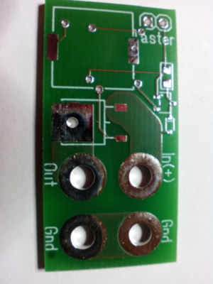

.Leere Platine unten
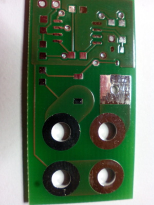

.Platine bestückt ohne MOSFETs oben
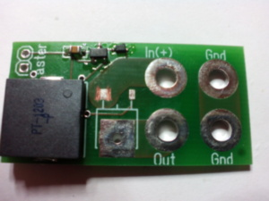

.Platine bestückt ohne MOSFETs unten
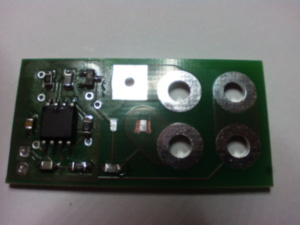

.Platine bestückt mit MOSFETs oben
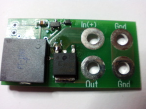

.Platine bestückt mit MOSFETs unten
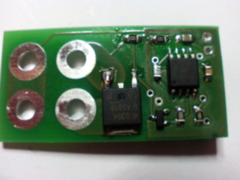

endif::short[]

[[Var2]]
==== Variante 32V/60A

ifdef::short[]

[TIP]
In der Kurzversion der Anleitung sind keine Bilder enthalten.
endif::[]

ifndef::short[]

.Leere Platine oben
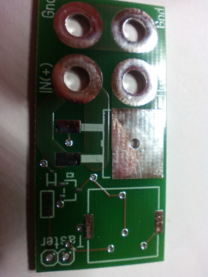

.Leere Platine unten
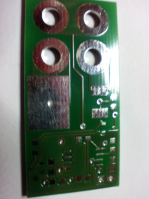

.Platine bestückt ohne MOSFETs oben
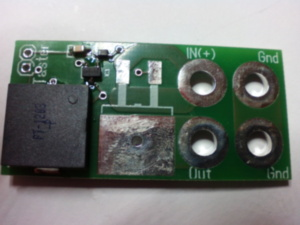

.Platine bestückt ohne MOSFETs unten
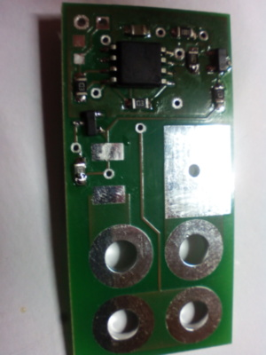

.Platine bestückt mit MOSFETs oben
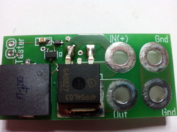

.Platine bestückt mit MOSFETs unten
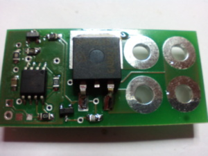

endif::[]

[[first]]
=== Erste Inberiebnahme

Die erste Inbetriebnahme _muss_ unbedingt

* ohne Verbraucher
* mit einem Labornetzteil mit einstellbarer Spannung und Strombegrenzung 

erfolgen. Am Ausgang des Moduls schließen Sie ein Multimeter oder eine LED mit passendem Vorwiderstand an.

Stellen Sie ein:

* Spannung: 8V
* Strombegrenzung: 50mA

Schließen Sie _erst jetzt_ das Modul eingangsseitig an das Labornetzteil an. Die Strombegrenzung des Labornetzteils _darf nicht_ 
ansprechen. Der Stromverbrauch sollte in der Anzeige zunächst nicht mehr als 2mA sein und nach drei Sekunden auf 2µA sinken.

Führen Sie erst nun die Einschalt- und Ausschaltsequenz aus und beobachten Sie die Ausgangsspannung bzw. LED. 

[CAUTION]
Bauen Sie erst dann das Modul in ein Modell ein, wenn Sie sich von der einwandfreien Funktion überzeugt haben.

== Kontakt

Anfragen: wilhelm.wm.meier@googlemail.com

