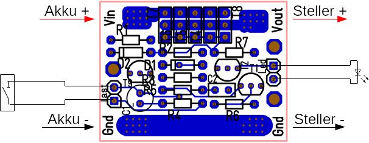

// -*- mode: adoc ; fill-column: 120 -*-
// ---- Beginn Standardheader
= Elektronischer Hauptschalter Bausatz
Wilhelm Meier <wilhelm.wm.meier@googlemail.com>
:revnumber: 0.01
:revdate: 01.01.1970
:lang: de
:toc:
:toc-title: Inhalt
:toclevels: 4
:numbered:
:src_numbered: 
:icons: font
:icontype: svg
:figure-caption: Abbildung
:description: Elektronischer Hauptschalter
:title: Elektronischer Hauptschalter Bausatz
:title-page:
:sectanchors:
:sectlinks:
:experimental:
:copyright: Wilhelm Meier
:duration: 90
:source-highlighter: pygments
:pygments-css: class
:status:
:menu:
:navigation:
:split:
:goto:
:blank:
:showtitle:
:docinfo1:
:stem:
// for attributes in link:[] macro like link:xxx[window="_blank"]
:linkattrs:
:nofooter:

//:imgdir: ./images

//:short: // without images 

//include::license.adoc[]

<<<

== Vorwort

.Lizenz
****
This work is licensed under the Creative Commons Attribution-NonCommercial-ShareAlike 4.0 International License. To view a copy of this license, visit 
http://creativecommons.org/licenses/by-nc-sa/4.0[] or send a letter to Creative Commons, PO Box 1866, Mountain View, CA 94042, USA.
****

[NOTE]
Das Modul wie auch diese Doku ist noch unvollständig und _work-in-progess_. 
Bei jeglichen Unklarheiten in dieser Funktionsbeschreibung und generellem Aufbau und Anschluß, 
unterlassen Sie den Betrieb und kontaktieren Sie den Bausatzersteller.

<<<

== Symbolerklärung

[TIP]
Ein wichtiger allgemeiner Hinweis für den sicheren Aufbau und die sichere Bedienung. Dieser sollte durch den Anwender bachtet werden,
um einen sicheren Betrieb zu gewährleisten.

[NOTE]
Ein genereller Hinweis, der durch den Anwender beachtet werden sollte.

[IMPORTANT]
Ein technischer oder sicherheitstechnischer Hinweis, der unbedingt durch den Anwender beachtet werden muss.

[CAUTION]
Ein technischer oder sicherheitstechnischer Gefahrenhinweis, der unbedingt durch den Anwender beachtet werden muss. Zur 
Gefahrenabwendung muss der Anwender unbedingt die gegebenen Anweisungen befolgen und die beschriebenen Maßnahmen ergreifen.

== Rechtliches

Der vorliegende Bausatz wird dem Anwender für eigene Experimente überlassen. Er stellt kein Produkt im Sinne des ProdHaftG 
oder elektronisches Gerät im Sinne des ElektroG dar und wird als Gerät nicht kommerziell vertrieben. 

[IMPORTANT]
--
Die Überlassung gegen Unkostenerstattung erfolgt unter Ausschluss jeglicher Sach­mangelhaftung.

Für den vorliegenden Bausatz werden keine Funktionsgarantien gegeben. Für Schäden am Bausatz oder an damit verbundenen Geräten oder Modulen
wird keine Haftung übernommen. Gewährleistungen, Garantien und Widerrufsrechte gibt es nicht.
--

== Sicherheitshinweise

Beim Umgang mit Produkten, die mit elektrischer Spannung in Berührung kommen, müssen die gültigen VDE-Vorschriften beachtet werden, insbesondere 
VDE 0100, VDE 0550/0551, VDE 0700, VDE 0711 und VDE 0860.

Werkzeuge dürfen an Geräten, Bauteilen oder Baugruppen nur benutzt werden, wenn sichergestellt ist, dass die Geräte von der Versorgungsspannung 
getrennt sind und elektrische Ladungen, die in den im Gerät befindlichen Bauteilen gespeichert sind, vorher entladen wurden.

Spannungsführende Kabel oder Leitungen, mit denen das Gerät, das Bauteil oder die Baugruppe verbunden ist, müssen stets auf Isolationsfehler 
oder Bruchstellen untersucht werden. Bei Feststellen eines Fehlers in der Zuleitung muss das Gerät unverzüglich aus dem Betrieb genommen werden, 
bis die defekte Leitung ausgewechselt worden ist. Bei Einsatz von Bauelementen oder Baugruppen muss stets auf die strikte Einhaltung der in der 
zugehörigen Beschreibung genannten Kenndaten für elektrische Größen hingewiesen werden. Wenn aus einer vorliegenden Beschreibung für den nicht 
gewerblichen Endverbraucher nicht eindeutig hervorgeht, welche elektrischen Kennwerte für ein Bauteil oder eine Baugruppe gelten, wie eine 
externe Beschaltung durchzuführen ist oder welche externen Bauteile oder Zusatzgeräte angeschlossen werden dürfen und welche Anschlusswerte 
diese externen Komponenten haben dürfen, so muss stets ein Fachmann um Auskunft ersucht werden. Es ist vor der Inbetriebnahme eines Gerätes 
generell zu prüfen, ob dieses Gerät oder Baugruppe grundsätzlich für den Anwendungsfall, für den es verwendet werden soll, geeignet ist!

Im Zweifelsfalle sind unbedingt Rückfragen bei Fachleuten, Sachverständigen oder den Herstellern der verwendeten Baugruppen notwendig!

Bitte beachten Sie, dass Bedien- und Anschlussfehler außerhalb unseres Einflussbereiches liegen. Verständlicherweise können wir für Schäden, die 
daraus entstehen, keinerlei Haftung übernehmen. Bei Installationen und beim Umgang mit Netzspannung sind unbedingt die VDE-Vorschriften zu 
beachten. Geräte, die an einer Spannung über 35 V betrieben werden, dürfen nur vom Fachmann angeschlossen werden. In jedem Fall ist zu prüfen, 
ob der Bausatz oder die Platine für den jeweiligen Anwendungsfall und Einsatzort geeignet ist bzw. eingesetzt werden kann.

Derjenige, der eine Schaltung oder einen Bausatz aufbaut und fertigstellt oder eine Baugruppe durch Erweiterung bzw. Gehäuseeinbau 
betriebsbereit macht, gilt nach DIN VDE 0869 als Hersteller und ist verpflichtet, bei der Weitergabe des Gerätes alle Begleitpapiere 
mitzuliefern und auch seinen Namen und Anschrift anzugeben. Geräte, die aus Bausätzen selbst zusammengestellt werden, sind sicherheitstechnisch 
wie ein industrielles Produkt zu betrachten.

Für alle Personen- und Sachschäden, die aus nicht bestimmungsgemäßer Verwendung entstehen, ist nicht der Hersteller sondern der Betreiber 
verantwortlich. Bitte beachten Sie, das Bedien- und/und Anschlussfehler außerhalb unseres Einfußbereiches liegen. Verständlicherweise können wir 
für Schäden, die daraus entstehen, keinerlei Haftung übernehmen.

Jegliche Vorschriften und Vorsichtsmaßnahmen im Umgang mit elektrischen Komponenten sind vom Anwender einzuhalten.

Beachten Sie ebenfalls die Richtlinien unter <<Betrieb>>.

== Spezieller Sicherheitshinweis: Kleinteile

[CAUTION]
--
ACHTUNG: Der Bausatz enthält verschluckbare Kleinteile. Von Kindern fernhalten.
--

<<< 

== Bekannte Fehler

[IMPORTANT]
Folgenden *Fehler* sind bekannt. Bitte beachten Sie die entsprechenden Hinweise!

[horizontal]
Falscher Bestückungsaufdruck:: Auf der Platine ist die Bezeichnung von Widerstand `R4` und `R5` vertauscht. Der Widerstand `R4` muss also dort bestückt werden, 
wo der `R5` steht und umgekehrt.

<<<

== Einbau 

.Der Hauptschalter
image::simple/simple_3d.png[]

Das Modul dient zum zentralen Einschalten der zentralen Stromversorgung von Schiffsmodellen. Das Einschalten und das Ausschalten 
erfolgen über einen Tastkontakt (Reed-Kontakt). Das Modul gibt optische Rückmeldung (LED) über seinen Zustand.

Das folgende Bild zeigt den Einbau schematisch:

[[schema1]]
.Schematischer Anschluß des Hauptschalters an Akku, Verbraucher (Steller), LED und Kontakt

=== Anschluß an den Akku

Für einen ordnungsgemäßen Betrieb ist das Modul mit entsprechenden Kabeln zu versehen, die einen ausreichenden Querschnitt 
aufweisen.

Die Anschlüsse `Vin` (Plus) / `Gnd` sind mit dem Akku zu verbinden.

Die Anschlüsse `Vout` (Plus) / `Gnd` sind mit den zu versorgenden Geräten zu verbinden.

Ein Verpolen der Anschlüsse kann zu einem Defekt führen.

[CAUTION]
Achten Sie neben ausreichenden Querschnitten der Kabel auch immer auf kurze Verbindungen, vor allem vom Akku zu Hauptschalter bzw. 
bei allen, hohen Strom führenden Leitungen.

=== Anschluß des Tastkontaktes

An den mit `Taster` gekennzeichneten Pfostenverbinder ist ein Taster (kein Schalter) oder Reed-Kontakt anzuschließen. 

[CAUTION]
--
Der Anschluß des Tasters sollte über ein verdrilltes Leitungspaar erfolgen. Es reicht ein sehr dünner Querschnitt aus, da hier keine 
hohen Ströme fließen. Das Leitungspaar sollte nicht parallel zu Leitungen mit hohen Strömen und Impulsen (etwa Motorzuleitungen) 
im Modell verlegt werden. Die Leitungslänge sollte 75cm nicht überschreiten.
--

Vor der Montage eines Reed-Kontaktes die _Vorzugsrichtung_ des Reed-Kontaktes ermitteln, damit ein sicheres Ansprechen 
gewährleistet ist. Vorsicht beim Biegen der Anschlußdrähte eines Reed-Kontaktes, denn diese brechen leicht.

Beachten Sie den maximalen Abstand des Magneten zum Reed-Kontakt bei der Montage. Mehr als 1,5mm kann zu Problemen beim 
Ein- oder Ausschalten führen. Dies hängt wesentlich von der Stärke des Magneten ab.

=== Schutz 

Um das Modul gegen Feuchtigkeit zu schützen, empfielt es sich, das Modul 
mit Polyurethan-Lack-Schutzlack (z.B. Kontakt 70) zu überziehen. Bitte kleben Sie jedoch voher den Pfostenverbinder für den Kontackt, den 
die Löt-Pads für die Anschlußkabel ab.

Ein Einschrumpfen mit Schrumpfschlauch ist möglich.

== Funktion

[[funcon]]
=== Einschalten

.Vorsichtsmaßnahmen
[CAUTION]
--
Treffen Sie die üblichen Sicherheitsvorkehrungen beim Einschalten von Stromversorgungen in Modellen.

Schalten Sie den Sender _vorher_ ein. Kontrollieren Sie die _Gasstellung_.
--

Betätigen Sie den Kontakt kurz bzw. nähern sie den Magneten kurz an den Reed-Kontakt. Nun ist das Modul im Zustand `EIN`.
Die LED leuchtet.

[[funcoff]]
=== Ausschalten

.Ausschalten von induktiven Lasten
[CAUTION]
--
Schalten Sie keine direkt angeschlossenen, induktiven Lasten (große Motoren, Transformatoren) im laufenden Betrieb aus. 
Dadurch kann das Modul zerstört werden, wenn der maximale Schaltstrom überschritten wird. 
--

Betätigen Sie den Kontakt kurz bzw. nähern sie den Magneten kurz an den Reed-Kontakt. Nun ist das Modul im Zustand `AUS`.
Die LED ist dunkel.

=== Ruhe

Im ausgeschalteten Zustand verbraucht das Modul keinen nennenswerten Strom und kann dauerhaft am Akku verbleiben.

[[Variants]]
== Varianten

[CAUTION]
Unterhalb einer Eingangsspannung von 4V ist kein gesicherter Betrieb mehr möglich. Daher ist es sinnvoll,
eine Telemetriefunktion zur Unterspannungserkennung einzusetzen. Bei stark abnehmender Spannung ist daher sofort eine 
Rückkehr des Schiffsmodells zum Ufer angebracht. Anderfalls kann es zu einem totalen Stromausfall kommen.

[TIP]
Die Varianten unterscheiden sich in der max. Strombelastbarkeit. Dies wird durch eine unterschiedliche Anzahl von Leistungstransistoren erreicht.
Diese können auch jederzeit nachbestückt werden.

=== Variante 30V/10A

[horizontal]
Spannungfestigkeit:: maximal 30V (LiPo: 6S)
minimale Betriebsspannung:: 5V
Strombelastbarkeit:: maximal 10A (nur im *Kurzzeitbetrieb*: 10% ED S3)
Schaltstrom:: maximal 3A (direktes Schalten von Verbrauchern)
Anzahl Leistungstransistoren:: 1

=== Variante 30V/20A

[horizontal]
Spannungfestigkeit:: maximal 30V (LiPo: 6S)
minimale Betriebsspannung:: 5V
Strombelastbarkeit:: maximal 20A (nur im *Kurzzeitbetrieb*: 10% ED S3)
Schaltstrom:: maximal 5A (direktes Schalten von Verbrauchern)
Anzahl Leistungstransistoren:: 2

=== Variante 30V/30A

[horizontal]
Spannungfestigkeit:: maximal 30V (LiPo: 6S)
minimale Betriebsspannung:: 5V
Strombelastbarkeit:: maximal 30A (nur im *Kurzzeitbetrieb*: 10% ED S3)
Schaltstrom:: maximal 10A (direktes Schalten von Verbrauchern)
Anzahl Leistungstransistoren:: 3

=== Variante 30V/40A

[horizontal]
Spannungfestigkeit:: maximal 30V (LiPo: 6S)
minimale Betriebsspannung:: 5V
Strombelastbarkeit:: maximal 40A (nur im *Kurzzeitbetrieb*: 10% ED S3)
Schaltstrom:: maximal 15A (direktes Schalten von Verbrauchern)
Anzahl Leistungstransistoren:: 4

=== Variante 30V/50A

[horizontal]
Spannungfestigkeit:: maximal 30V (LiPo: 6S)
minimale Betriebsspannung:: 5V
Strombelastbarkeit:: maximal 50A (nur im *Kurzzeitbetrieb*: 10% ED S3)
Schaltstrom:: maximal 20A (direktes Schalten von Verbrauchern)
Anzahl Leistungstransistoren:: 5

[[Betrieb]]
== Betrieb

=== Einsatzbereich

Die unter <<Variants>> angegebenen Grenzen hinsichtlich _Spannungsfestigkeit_ und _Strombelastbarkeit_ sind *unbedingt* einzuhalten. Beachten Sie die unterschiedlichen 
_Varianten_.

.Unterspannung
[IMPORTANT]
Ein gesicherter Betrieb _unterhalb_ von 5V ist nicht gegeben. Vor allem wird unterhalb dieser Schwelle nicht die volle Strombelastbarkeit erreicht. 

[TIP]
Beachten Sie unbedingt die Anweisungen unter <<first>>.

=== Sicherheit

[NOTE]
Die üblichen Sicherheitsvorkehrungen im Betrieb mit ferngesteuerten Modellen, insbesonder Schiffsmodellen sind einzuhalten.

[IMPORTANT]
Beachten Sie *alle* folgenden Hinweise zum Betrieb.

[CAUTION]
Eine Verwendung des Moduls in Rennbooten oder Flogmodellen ist nicht zulässig.

[CAUTION]
Das Modul darf nicht in Kontakt mit Wasser, Wasserdampf oder anderen Flässigkeiten kommen. Wasser oder Wasserdampf bzw. andere 
Flüssigkeiten können zu einem Totalausfall 
und damit zu einem Modellverlust sowie Personenschäden führen.

[CAUTION]
Das Modul verbraucht im Ruhezustand nur sehr wenig Strom. Trotzdem darf ein dauerhafter Anschluß an einen *unüberwachten* Akku nicht erfolgen.
Hier besteht Brandgefahr! Gefahr von Personenschäden!

[CAUTION]
Beim Betrieb ist die Erwärmung des Moduls zwingend zu überwachen! Eine Überhitzung kann zu einem Totalausfall und damit 
zu einem Modellverlust führen. Gefahr von Personenschäden!

[CAUTION]
Die Spannunsgversorgung ist Moduls ist im Betrieb zu überwachen. Bei Unterspannung kann das Modul abschalten oder bei gleichzeitiger 
hoher Stromaufnahme überhitzen und so zu einem Totalausfall 
und damit zu einem Modellverlust sowie Personenschäden führen

[CAUTION]
Die erforderlichen Kabelquerschnitte für die Verbindung mit dem Akku und auch mit dem elektrischen Verbraucher sind unbedingt einzuhalten. 
Hier besteht Brandgefahr. Gefahr von Personenschäden!

[CAUTION]
Beim Betrieb ist der maximale Stromdurchfluß zu begrenzen und zu überwachen. Ein zu langer und zu hoher Stromfluß kann zu einem Totalausfall 
und damit zu einem Modellverlust sowie Personenschäden führen.

[CAUTION]
Das Modul ist nicht kurzschlußfest. Ein Kurzschluß führt zu einem Totalausfall 
und damit zu einem Modellverlust sowie Personenschäden.

[CAUTION]
Der maximale Schaltstrom ist ist unbedingt einzuhalten und darf nicht überschritten werden. Ein zu hoher Schaltstrom kann zu einem Totalausfall 
und damit zu einem Modellverlust sowie Personenschäden führen.

[CAUTION]
Die Kapazitäten (Elkos, Siebelkos) am Ausgang des Moduls, etwa in Fahrtreglern (Stellern) für Motoren, 
dürfen 10.000µF nicht überschreiten. Zu hohe Kapazitäten können zu einem Totalausfall 
und damit zu einem Modellverlust sowie Personenschäden führen.

[CAUTION]
Das Modul darf keinen Vibrationen ausgesetzt werden. Treffen Sie entsprechende Vorkehrungen zu einem vibrationsgeschützten Einbau. Zu starke 
Vibrationen können zu einem Totalausfall und damit zu einem Modellverlust sowie Personenschäden führen.

[CAUTION]
Das Modul darf nur innerhalb eines Temperaturbereiches von -10°C bis +55°C betrieben werden. Ein Betrieb außerhalb dieses 
Bereiches kann zu einem Totalausfall und damit zu einem Modellverlust sowie Personenschäden führen.

== Aufbau 

Der Bausatz enthält alle Einzelteile zum Aufbau des Moduls. 

=== Schrittweise Anleitung

Für den Zusammenbau sind keine Spezialkentnisse oder Spezialwerkzeug erforderlich. Es sollte jedem Modellbauer gelingen.

.Werkzeuge und Hilfsmittel
[TIP]
Benutzen Sie einen feinen und *geregelten* Lötkolben von mindestens 25W Leistung (bei Lötstationen bbis 80W). Benutzen Sie nur 
*Elektroniklot* mit eine *Flussmittelseele* von 0,5mm bis 1mm Stärke. Verwenden Sie zum Abschneiden der überstehenden Bauteildrähte einen 
*Elektronikseitenschneider*. Schneiden Sie die Drähte auf der Unterseite der Platine knapp über des Lötpunktes ab.

Löten Sie alle Bauteile wie angegeben auf. Hierzu muss ein ausreichend starker Lötkolben verwendet werden. Achten Sie auch auf eine hohe Löttemperatur (400 °C) und eine kurze Lötdauer. 

[IMPORTANT]
Bei zu langer Lötdauer können die Bauteile zerstört werden.

==== Bestückung

Die Bestückung erfolgt aus praktischen Gründen von kleinen und niedrigen Bauteilen zu größeren höheren Bauteilen. *Alle* Bauteile werden von der Oberseite
der Platine bestückt. Hier ist auch ein Bestückungsaufdruck zu sehen.

[IMPORTANT]
Beachten Sie den Fehler im Bestückungsaufdruck: die Bezeichnungen `R4` und `R5` sind vertauscht.

.Oberseite (ohne Leiterbahnen)
image::onoff_simple_parts01-1.png[width=500,align=center]

.Oberseite (mit Leiterbahnen)
image::onoff_simple_parts02-1.png[width=500,align=center]

===== Dioden

Die beiden Dioden _D1_ und _D2_ dürfen nicht verwechselt werden. Identifizieren Sie die Dioden anhand der Bilder. 

Die Dioden *müssen* auch in einer bestimmten Richtung eingebaut werden. Die Kathode ist jeweils beim Strich auf dem Gehäuse bzw. dem zusätzlichen Strick im Bestückungsaufdruck.

D1:: (1N4148 oder SD103)

.Diode *D1* bestückt
image::simple/simple_d1.jpg[width=500,align=center]

D2:: Z-Diode 18V 

.Diode *D2* bestückt
image::simple/simple_d2.jpg[width=500,align=center]

===== Widerstände

Die Widerstände lassen sich eindeutig an ihrer Farbcodierung für den Widerstandswert erkennen. 
Das Schema bezeichnet man als https://www.elektronik-kompendium.de/sites/bau/1109051.htm[Farbcode]

R1:: 33K orange-orange-orange

.Widerstand *R1* bestückt
image::simple/simple_r1.jpg[width=500,align=center]

R2:: 1M braun-schwarz-grün

.Widerstand *R2* bestückt
image::simple/simple_r2.jpg[width=500,align=center]

R3:: 27K rot-lila-orange

.Widerstand *R3* bestückt
image::simple/simple_r3.jpg[width=500,align=center]

R4:: 330K (Beschriftung R5) orange-orange-gelb

[IMPORTANT]
Bitte beachtenm Sie die falsch positionierte Beschriftung von `R4` (fälschlicherweise mit `R5` vertauscht) und identifizieren Sie die korrekte Position auch anhand des Fotos.

.Widerstand *R4* bestückt
image::simple/simple_r4.jpg[width=500,align=center]

R5:: 1M (Beschriftung R4) braun-schwarz-grün

[IMPORTANT]
Bitte beachtenm Sie die falsch positionierte Beschriftung von `R5` (fälschlicherweise mit `R4` vertauscht) und identifizieren Sie die korrekte Position auch anhand des Fotos.

.Widerstand *R5* bestückt
image::simple/simple_r5.jpg[width=500,align=center]

R6:: 680 blau-grau-braun

.Widerstand *R6* bestückt
image::simple/simple_r6.jpg[width=500,align=center]

R7:: 1K braun-schwarz-rot

.Widerstand *R7* bestückt
image::simple/simple_r7.jpg[width=500,align=center]

===== Kondensatoren

Der Kondensator _C1_ ist ein _Elektrolykondensator und *muss* in einer bestimmten Richtung eingebaut werden. Auf dem Gehäuse ist ein andersfarblicher Strich mit einem
kleiner `-` Zeichen auf der Seite, wo das entsprechende Beinchen ist. Dies muss in die Bohrung, die ebenfalls gekennzeichnet ist.

C1:: 47µF 

.Kondensator *C1* bestückt
image::simple/simple_c1.jpg[width=500,align=center]

C2:: 100nF

.Kondensator *C2* bestückt
image::simple/simple_c2.jpg[width=500,align=center]

===== Transistoren

Die Transistoren _T9_, _T2_ und _T1_ sind leicht verwechselbar. Auf der flachen Seite des Gehäuses steht die Bezeichnung. Benutzen sie ggf. eine 
Lichtlupe, um die Schrift eindeutig zu erkennen.

Beachten Sie auch die korrekte Einbauposition anhand des Bestückungsaufdrucks. Wichtig: abgeflachte Seite des Gehäuses.

T9:: VP2106

.Transistor *T9* bestückt
image::simple/simple_t1.jpg[width=500,align=center]

T2:: 2N7000G

.Transistor *T2* bestückt
image::simple/simple_t3.jpg[width=500,align=center]

T1:: J111

.Transistor *T1* bestückt
image::simple/simple_t2.jpg[width=500,align=center]

T3:: entfällt

An dieser Stelle *empfiehlt* es sich, *zunächst* den Reed-Kontakt (Taster) und die LED anzuschließen (s.a. <<ext>>). Wenn das erfolgt ist, kann
auch ein erster Funktionstest gemacht werden, bevor die folgenden Transitoren eingebaut werden.

Achten Sie auf die korrekte Einbaurichtung der Leistungstransistoren (s.a. Bild). Die Metallfläche der Leistungstransistoren muss zum _Vin_-Anschluss 
zeigen.

T4 - T8:: AOI21357

Bauen Sie diese Leistungstransistoren _schrittweise_ ein: nach einem _ersten_ Zwischentest (s.u.) _ohne_ diese Transistoren, löten Sie 
zunächst nur _einen_ ein und testen Sie wieder. Erst danach fahren Sie mit den weiteren Leistungstransistoren fort.

.Einer der Transistoren *T4* - *T8* bestückt
image::simple/simple_fet.jpg[width=500,align=center]

[[ext]]
==== Externe Anschlüsse

Die Platine hat Anschlusspärchen für den Reed-Kontakt und für die LED. Auf den folgenden Fotos ist die LED auf der Platine verlötet und der Kontakt mit einem
Pfostenverbinder angeschlossen. Dies ist nur für diese Anleitung so geschehen und hängt stark von der konkreten Einbausituation ab. Beides kann auch mit einem zweiadrigen
Kabel verlängert werden, um die Bauteile an gut zugänglichen bzw. sichtbaren Stellen im Modell einzubauen.

===== Reed-Kontakt oder Taster

[CAUTION]
Der _Reed_-Kontakt hat einen *Glaskörper*. Dieser ist recht empfindlich und zerbricht bei starker mechanischer Beanspruchung leicht. Daher die Anschlussdrähte 
nur sehr vorsichtig abwinkeln.

Löten Sie an den Reed-Kontakt ein dünnes zweiadriges Kabel und verbinden Sie dies mit der Platine. Die Polung ist dabei egal. 

Bei einer größeren Kabellänge (> 10cm) sollte ein verdrilltes Kabel verwendet werden.

.Anschluss _Reed_-Kontakt
image::simple/simple_reed.jpg[width=500,align=center]

.Anschluss _Reed_-Kontakt
image::simple/simple_reed2.jpg[width=500,align=center]

===== Kontroll-LED

Auf Polung achten: abgeflachte Seite oder kurzes Beinchen zu den Leistungstransistoren gerichtet. Eine falsch herum gepolte LED geht nicht kaputt, sondern leuchtet
dann einfach nur nicht.

.Anschluss LED
image::simple/simple_led1.jpg[width=500,align=center]

.Anschluss LED
image::simple/simple_led2.jpg[width=500,align=center]

Die Zuleitung zur LED kann auch mit einem dünnen kabel verlängert werden.

===== Zuleitungen

Der Anschluß der Zuleitungen erfolt auf den Pads auf der *Unterseite* der Platine. Achten Sie auch den erforderlichen Querschnitt.

[[first]]
=== Erste Inberiebnahme

Die erste Inbetriebnahme _muss_ unbedingt

* ohne Verbraucher
* mit einem Labornetzteil mit einstellbarer Spannung und Strombegrenzung 

erfolgen. Am Ausgang des Moduls schließen Sie ein Multimeter als Spannungsmesser an. 

Stellen Sie ein:

* Spannung: 8V
* Strombegrenzung: 50mA

Schließen Sie _erst jetzt_ das Modul eingangsseitig an das Labornetzteil an. Die Strombegrenzung des Labornetzteils _darf nicht_ 
ansprechen. Der Stromverbrauch sollte in der Anzeige nicht messbar sein.

Führen Sie erst nun die Einschalt- und Ausschaltsequenz aus und beobachten Sie die Ausgangsspannung bzw. LED. 

.Zwischentest während des Bauens
[TIP]
--
Wird ein _Zwischentest_ während des Bauens ohne die Leistungstransistoren durchgeführt, so kann amn Ausgang zwar keine Spannung festgestellt werden, jedoch
muss die Funktion anhand der LED beobachtet werden können.

Dieser *Zwischentest* schützt vor einem Zerstören der teuren Leistungstransistoren und erleichtet ggf. die Fehlersuche.
--

[CAUTION]
Bauen Sie erst dann das Modul in ein Modell ein, wenn Sie sich von der einwandfreien Funktion überzeugt haben.

== Kontakt

Anfragen: wilhelm.wm.meier@googlemail.com

<<<

== Stückliste

[horizontal]
D1:: (1N4148 oder SD103)
D2:: Z-Diode 18V 
R1:: 33K orange-orange-orange
R2:: 1M braun-schwarz-grün
R3:: 27K rot-lila-orange
R4:: 330K (Beschriftung R5) orange-orange-gelb
R5:: 1M (Beschriftung R4) braun-schwarz-grün
R6:: 680 blau-grau-braun
R7:: 1K braun-schwarz-rot
C1:: 47µF 
C2:: 100nF
T9:: VP2106
T2:: 2N7000G
T1:: J111
T4 - T8:: AOI21357
Reed:: Kontakt
LED:: Led
Platine:: Platine

