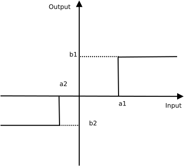
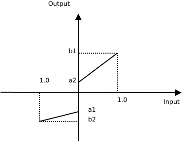
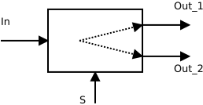
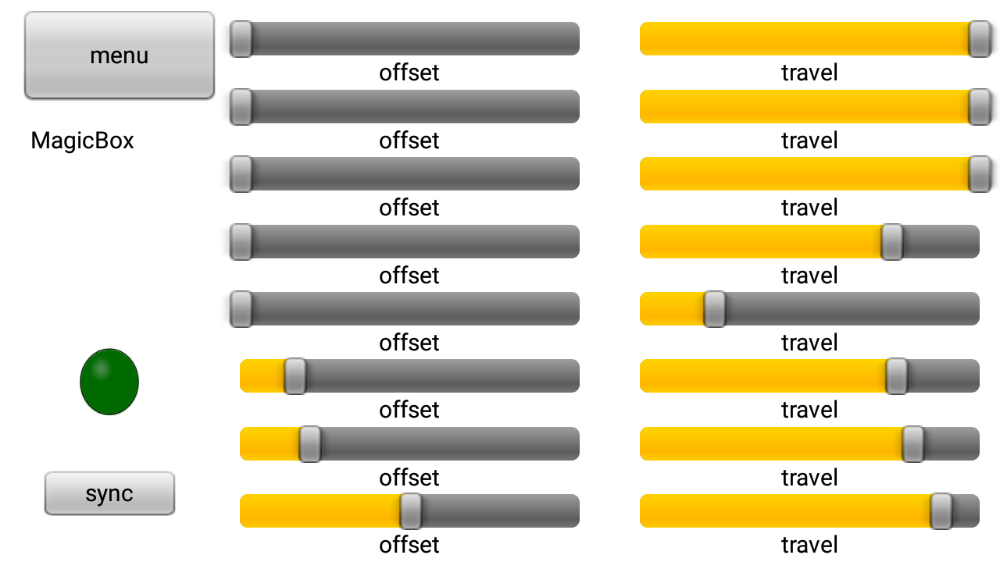
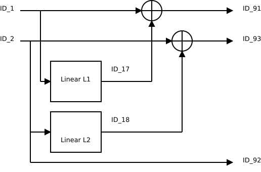
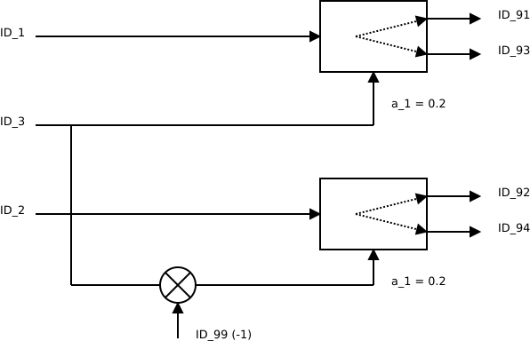
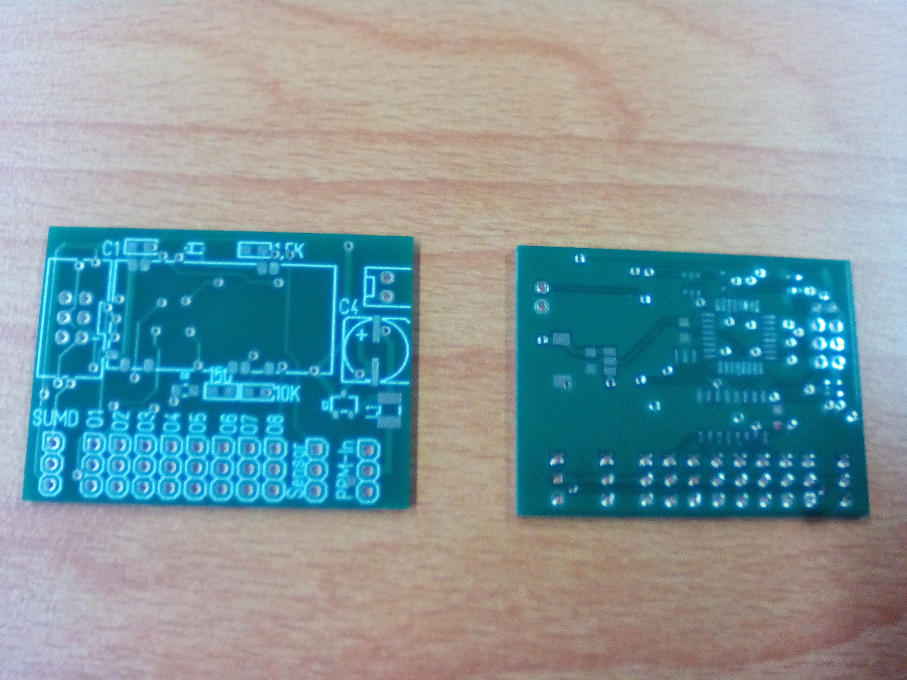
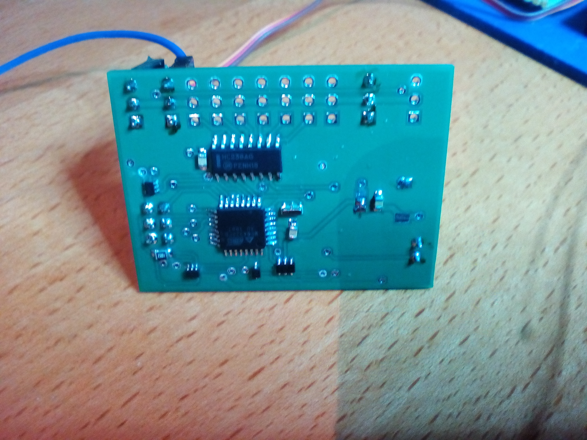
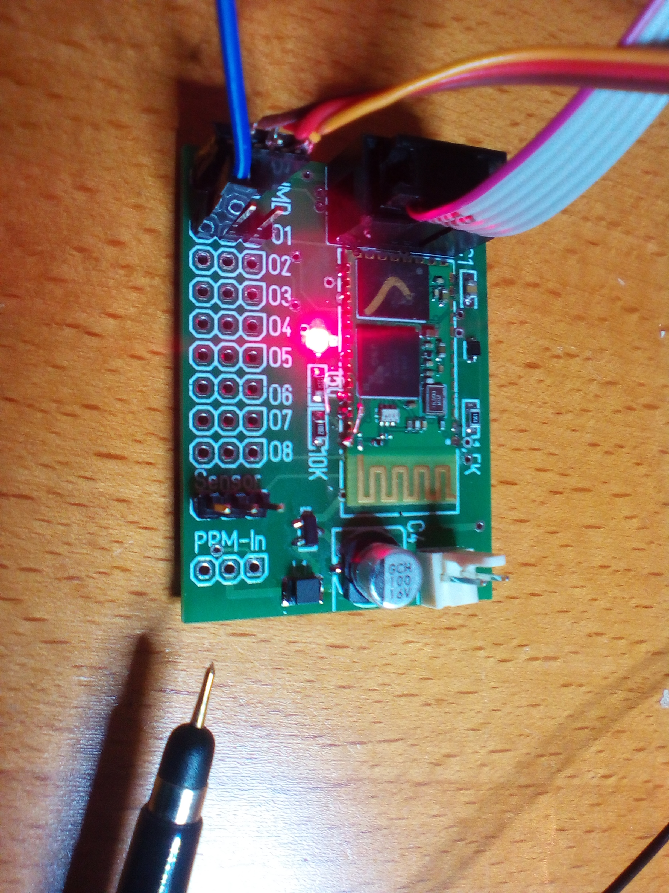

// -*- mode: adoc ; fill-column: 120 -*-
// ---- Beginn Standardheader
= Matrix-Mischer Modul
Wilhelm Meier <wilhelm.wm.meier@googlemail.com>
:revnumber: 0.01
:revdate: 01.01.1970
:revremark: undefined
:lang: de
:toc:
:toc-title: Inhalt
:toclevels: 4
:numbered:
:src_numbered: 
:icons: font
:icontype: svg
:figure-caption: Abbildung
:description: Matrix-Mischer Modul
:title: Matrix-Mischer Modul
:sectanchors:
:sectlinks:
:experimental:
:copyright: Wilhelm Meier
:duration: 90
:source-highlighter: coderay
:coderay-css: style
:source-highlighter: pygments
:pygments-css: class
:status:
:menu:
:navigation:
:split:
:goto:
:blank:
:deckjs_theme: swiss
:showtitle:
:deckjs_transition: horizontal-slide
//:stylesdir: ./css
//:stylesheet: deckjs.css
:docinfo1:
:stem:
:customcss: css/deckjs.css
// not working
:revealjs_theme: black
:revealjs_slidenumber: true
// for attributes in link:[] macro like link:xxx[window="_blank"]
:linkattrs:
:nofooter:

:imgdir: images

//:short: // without images 

//include::license.adoc[]

////

== Symbolerklärung

[TIP]
Ein wichtiger allgemeiner Hinweis für den sicheren Aufbau und die sichere Bedienung. Dieser sollte durch den Anwender bachtet werden,
um einen sicheren Betrieb zu gewährleisten.

[NOTE]
Ein genereller Hinweis, der durch den Anwender beachtet werden sollte.

[IMPORTANT]
Ein technischer oder sicherheitstechnischer Hinweis, der unbedingt durch den Anwender beachtet werden muss.

[CAUTION]
Ein technischer oder sicherheitstechnischer Gefahrenhinweis, der unbedingt durch den Anwender beachtet werden muss. Zur 
Gefahrenabwendung muss der Anwender unbedingt die gegebenen Anweisungen befolgen und die beschriebenen Maßnahmen ergreifen.

== Rechtliches

Der vorliegende Bausatz wird dem Anwender für eigene Experimente überlassen. Er stellt kein Produkt im Sinne des ProdHaftG 
oder elektronisches Gerät im Sinne des ElektroG dar und wird als Gerät nicht kommerziell vertrieben. 

[IMPORTANT]
--
Die Überlassung gegen Unkostenerstattung erfolgt unter Ausschluss jeglicher Sach­mangelhaftung.

// Die Haftung wegen Arglist und Vorsatz sowie auf Schaden­ersatz wegen Körperverletzungen 
// sowie bei grober Fahr­lässig­keit oder Vorsatz bleibt unbe­rührt.

Für den vorliegenden Bausatz werden keine Funktionsgarantien gegeben. Für Schäden am Bausatz oder an damit verbundenen Geräten oder Modulen
wird keine Haftung übernommen. Gewährleistungen, Garantien und Widerrufsrechte gibt es nicht.
--

== Sicherheitshinweise

Beim Umgang mit Produkten, die mit elektrischer Spannung in Berührung kommen, müssen die gültigen VDE-Vorschriften beachtet werden, insbesondere 
VDE 0100, VDE 0550/0551, VDE 0700, VDE 0711 und VDE 0860.

Werkzeuge dürfen an Geräten, Bauteilen oder Baugruppen nur benutzt werden, wenn sichergestellt ist, dass die Geräte von der Versorgungsspannung 
getrennt sind und elektrische Ladungen, die in den im Gerät befindlichen Bauteilen gespeichert sind, vorher entladen wurden.

Spannungsführende Kabel oder Leitungen, mit denen das Gerät, das Bauteil oder die Baugruppe verbunden ist, müssen stets auf Isolationsfehler 
oder Bruchstellen untersucht werden. Bei Feststellen eines Fehlers in der Zuleitung muss das Gerät unverzüglich aus dem Betrieb genommen werden, 
bis die defekte Leitung ausgewechselt worden ist. Bei Einsatz von Bauelementen oder Baugruppen muss stets auf die strikte Einhaltung der in der 
zugehörigen Beschreibung genannten Kenndaten für elektrische Größen hingewiesen werden. Wenn aus einer vorliegenden Beschreibung für den nicht 
gewerblichen Endverbraucher nicht eindeutig hervorgeht, welche elektrischen Kennwerte für ein Bauteil oder eine Baugruppe gelten, wie eine 
externe Beschaltung durchzuführen ist oder welche externen Bauteile oder Zusatzgeräte angeschlossen werden dürfen und welche Anschlusswerte 
diese externen Komponenten haben dürfen, so muss stets ein Fachmann um Auskunft ersucht werden. Es ist vor der Inbetriebnahme eines Gerätes 
generell zu prüfen, ob dieses Gerät oder Baugruppe grundsätzlich für den Anwendungsfall, für den es verwendet werden soll, geeignet ist!

Im Zweifelsfalle sind unbedingt Rückfragen bei Fachleuten, Sachverständigen oder den Herstellern der verwendeten Baugruppen notwendig!

Bitte beachten Sie, dass Bedien- und Anschlussfehler außerhalb unseres Einflussbereiches liegen. Verständlicherweise können wir für Schäden, die 
daraus entstehen, keinerlei Haftung übernehmen. Bei Installationen und beim Umgang mit Netzspannung sind unbedingt die VDE-Vorschriften zu 
beachten. Geräte, die an einer Spannung über 35 V betrieben werden, dürfen nur vom Fachmann angeschlossen werden. In jedem Fall ist zu prüfen, 
ob der Bausatz oder die Platine für den jeweiligen Anwendungsfall und Einsatzort geeignet ist bzw. eingesetzt werden kann.

Derjenige, der eine Schaltung oder einen Bausatz aufbaut und fertigstellt oder eine Baugruppe durch Erweiterung bzw. Gehäuseeinbau 
betriebsbereit macht, gilt nach DIN VDE 0869 als Hersteller und ist verpflichtet, bei der Weitergabe des Gerätes alle Begleitpapiere 
mitzuliefern und auch seinen Namen und Anschrift anzugeben. Geräte, die aus Bausätzen selbst zusammengestellt werden, sind sicherheitstechnisch 
wie ein industrielles Produkt zu betrachten.

Für alle Personen- und Sachschäden, die aus nicht bestimmungsgemäßer Verwendung entstehen, ist nicht der Hersteller sondern der Betreiber 
verantwortlich. Bitte beachten Sie, das Bedien- und/und Anschlussfehler außerhalb unseres Einfußbereiches liegen. Verständlicherweise können wir 
für Schäden, die daraus entstehen, keinerlei Haftung übernehmen.

Jegliche Vorschriften und Vorsichtsmaßnahmen im Umgang mit elektrischen Komponenten sind vom Anwender einzuhalten.

Beachten Sie ebenfalls die Richtlinien unter <<Betrieb>>.

== Spezieller Sicherheitshinweis: Kleinteile

[CAUTION]
--
ACHTUNG: Der Bausatz enthält verschluckbare Kleinteile. Von Kindern fernhalten.
--

////

== Grundsätzliche Funktion

Das Modul dient dazu, ausgehend von den 8 bzw. 16 Kanalsignalen des Empfängers bis zu 8 PPM-Ausgangssignale zu generieren. Die Arbeitsweise ähnelt dabei den typischen Mischern in den modernen Sendern.

Die Eingangskanalsignale werde in Form eines SBUS/SUMD/IBUS digitalen Summensignals oder in Form eines analogen PPM-Summensignals (CPPM, SUMO) zur Verfügung gestellt. 

Die Ausgangssignale werden vom Modul als 8 _einzelne_ PPM-Signale zum direkten Anschluß von Servos, Stellern, etc. zur Verfügung gestellt.

Das Modul kann über 

. das moduleigene Bluetooth-Interface, oder über
. das Hott-Sensorprotokoll 

konfiguriert werden.

Ist das Bluetooth-Modul (mit einem Smartphone) im Zustand _paired_, dann steht die Hott-Sensorprotokoll-Schnittstelle nicht zur Verfügung.

Wird ein CPPM-Summensignal vom Modul detektiert, so ist das digitale Interface (SUMD, SBUS, IBUS) deaktiviert.

== Funktionsbausteine

Mit Hilfe von 

* bis zu 8 stückweise _linearen_ Übertragungsfunktionen
* bis zu 8 Sprungfunktionen
* bis zu 8 dualen Multiplikationsgliedern
* bis zu 8 dualen Summationsgliedern
* bis zu 8 dualen Halte-Umschaltglieder

können ausgehend von den max. 16 Eingangssignalen bis zu 64 Zwischensignale und die 8 Ausgangssignale erzeiugt werden.

Alle Signale werden durch ihre ID-Nummer identifiziert. Es gilt:

* ID_0: konstantes 0-Signal
* ID_1 ... ID_16: die 16 Eingangssignale 
* ID_17 ... ID_90: 64 beliebige Zwischensignale
* ID_91 ... ID_98: die 8 Ausgangssignale
* ID_99: konstantes (-1)-Signal

=== Funktionsblöcke

==== Summationsglied 

Dies Übertragungsglied hat 2 Eingänge (ID_0 ... ID_90) und einen Ausgang (ID_17 ... ID_98).

Der Ausgangswert ist die Addition der Eingangswerte.

Das Übertragungsglied hat keine weiteren Parameter.

==== Multiplikationsglied 

Dies Übertragungsglied hat 2 Eingänge (ID_0 ... ID_90) und einen Ausgang (ID_17 ... ID_98).

Der Ausgangswert ist die Multiplikation der Eingangswerte.

Das Übertragungsglied hat keine weiteren Parameter.

==== Sprungfunktionsglied

Dies Übertragungsglied hat einen Eingäng (ID_0 ... ID_90) und einen Ausgang (ID_17 ... ID_98).

Das Übertragungsglied hat die Parameter a_1, a_2, b_1, b_2.

.Übertragungsfunktion des Sprunggliedes

==== Stückweise-lineares Glied

Dies Übertragungsglied hat einen Eingäng (ID_0 ... ID_90) und einen Ausgang (ID_17 ... ID_98).

Das Übertragungsglied hat die Parameter a_1, a_2, b_1, b_2.

.Übertragungsfunktion des stückweise-linearen Gliedes

==== Halte-Umschaltglied

Dies Übertragungsglied hat zwei Eingänge (ID_0 ... ID_90) und zwei Ausgang (ID_17 ... ID_98).

Ein Eingang ist ein normaler Signaleingang. Der andere ist ein Schalteingang. 

Das Übertragungsglied hat einen Parameter a_1.

Ist das Signal am Schalteingang kleiner als die Schwelle a_1, wird das Eingangssignal unverändert an Out_1 weitergegeben.

Ist das Signal am Schalteingang größer als die Schwelle a_1, wird das Eingangssignal unverändert an Out_2 weitergegeben.

Beim Umschalten behält der jeweils andere Ausgang seine vorherigen Wert bei.

.Übertragungsweg des Gliedes

== Grundeinstellungen

Im Auslieferungszustand erwartet das Modul die Eingangssignale als SUMD (Graupner/SJ) am digitalen Eingang. 

Wir das Modul mit einen Bluetooth-Gerät ge-_paired_, hat diese Bluetooth-Schnittstelle Vorrang vor der Konfiguration über der 
Hott-Sensorschnittstelle. Die Konfiguration über Bluetooth kann nur in unmittelbarer Nähe (<10m) durchgeführt werden. Die Konfiguration 
über das <<hottsensor>> ist dagegen in Empfangsreichweite immer möglich.

=== Servosignaleingang

Die Eingangssignale können über unterschiedliche Protokolle und Schnittstelle angeliefert werden.

==== SUMD

Graupner/SJ-Standard zur Übermittelung von 12-16 Kanälen.

==== SBUS

Futaba-Standard zur Übermittelung von 12-16 Kanälen.

==== IBUS

FlySky-Standard zur Übermittelung von 12-16 Kanälen.

==== CPPM

Analoger Eingang zur Übermittelung von 8 Kanälen.

==== Einkanal-PPM

Analoger Eingang zur Übermittelung _eines_ Kanals.

[[hottsensor]]
=== Hott-Sensorprotokoll

Das Modul stellt sich als _Vario_ im Hott-Sensorprotokoll dar. Allerdings werden kein echten Telemetriedaten übermittelt. Diese Schnittstelle 
dient nur zur _Konfiguration_ in den Telemtrie-Einstellungen eines Hott-Senders. Dies ist qualitativ gleich mit der Bluetooth-Schnittstelle.

Ist deine Bluetooth-Verbindung aktiv, ist die Hott-Schnittstelle deaktiviert.

=== Ausgänge

An den acht Ausgängen werden die Signale immer als analoge PPM-Signale ausgegeben.

=== Debugterminal

Das Debugterminal ist immer auf die Baud-Rate des digitalen Eingangssignals eingestellt: 

* SUMD: 115,2KB
* SBUD, IBUS. 100KB

== Standardkonfigurationen

Die Standardkonfigurationen machen die Einrichtung des Moduls leichter, wenn keine besonderen Ansprüche oder Funktionen benötigt werden.

Zu jeder Standardkonfiguration gibt es eine entsprechende AppInApp für die App <<roboremo>>. Das Modul merkt sich, mit welcher AppInApp 
die aktuelle Konfiguration erzeugt worden ist. Wird der kbd:[Sync] Button gedrückt, wird eine Synchronisation der im Modul gespeicherten 
Konfiguration zur AppInApp vorgenommen. Sollte die falsche AppInApp ausgewählt worden sein, so wird die entsprechende Fehleranzeige 
gesetzt.

=== Magic-Box 8-8

Es wird das Verhalten der sog. Magic-Box (Fa. Graupner/SJ) nachempfungen. Jeder der Eingangskanäle 1 ... 8 wir auf den entsprechenden 
Ausgangskonnektor abgebildet. Bei dieser Abbildung kann 

* der Servoweg
* die Servomittenposition
* Richtung

angepasst werden.

.AppInApp für die MagicBox 88

=== Ebenenumschalter 2-4

Mit einem Ebenenumschalter können zwei unterschiedliche Gruppen von jeweils 4 beliebigen (auch überlappenden) Eingangskanälen auf die 
Ausgänge Q1...Q4 oder Q5...Q8 umgeschaltet werden.

Für den Schaltkanal kann die Schwelle festgelegt werden.

=== Fächer 2-4

Dieser Fächer besteht aus zwei gleichartigen Funktionsgruppen.

Eine Funktionsgruppe ermöglicht die Abbildung eines Eingangskanals auf 4 Ausgänge. Dabei kann je Ausgang

* der Servoweg
* die Servomittenposition
* Richtung

angepasst werden.

== Beispiele

=== Direktes Durchreichen eines Eingangssignales

Ein 1:1 lineares Übertragungsglied ermöglicht die unveränderte Übernahme eines Eingangssignales an einen Ausgangskanal. 

Um den Eingangskanal 2 (ID_2) an den Ausgangskanal 3 (ID_93) _unverändert_ weiter zu geben, definiert man ein linares Glied mitzuliefern

* Eingang ID_2
* Ausgang ID_93
* a_1 = 0.0
* a_2 = 0.0
* b_1 = 1.0
* b_2 = -1.0

=== Antriebsrudermischer

Die Mischer soll zur Unterstützung der Ruderfunktion einen Antriebsmotor schneller und den anderen entsprechend der Ruderwirkung langsamer kaufen lassen.

* ID_1  : Gas-Signal
* ID_2  : Ruder-Signal
* ID_91 : Steller 1
* ID_92 : Ruderservo
* ID_93 : Steller 2
* ID_17 : nicht-invertiertes, skaliertes Rudersignal
* ID_18 : invertiertes, skaliertes Rudersignal

Das Linearglied _L1_ wird parameteriert:

* a_1 = a2 = 0.0
* b_1 = 0.2
* b_2 = -0.2

Das Linearglied _L2_ wird parameteriert:

* a_1 = a2 = 0.0
* b_1 = -0.2
* b_2 = 0.2

Damit wird eine Ruderbeimischung von 20% zu den Stellersignalen erreicht.

.Blockdiagramm der gesamten Funktion

=== Funktionsebenen-Umschalter

Man kann mit Hilfe eines beliebigen Kanals etwa 2 Eingangssignale auf 2 x 2 Ausgangssignale umschalten.

.Übertragungsweg des Gliedes

[[roboremo]]
== RoboRemo

== Bilder

.Unbestückte Platine: oben und unten

.Bestückte Platine von unten

.Bestückte Platine von oben

== Kontakt

Anfragen: wilhelm.wm.meier@googlemail.com

